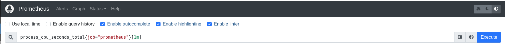
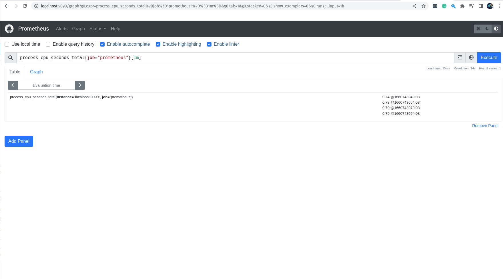
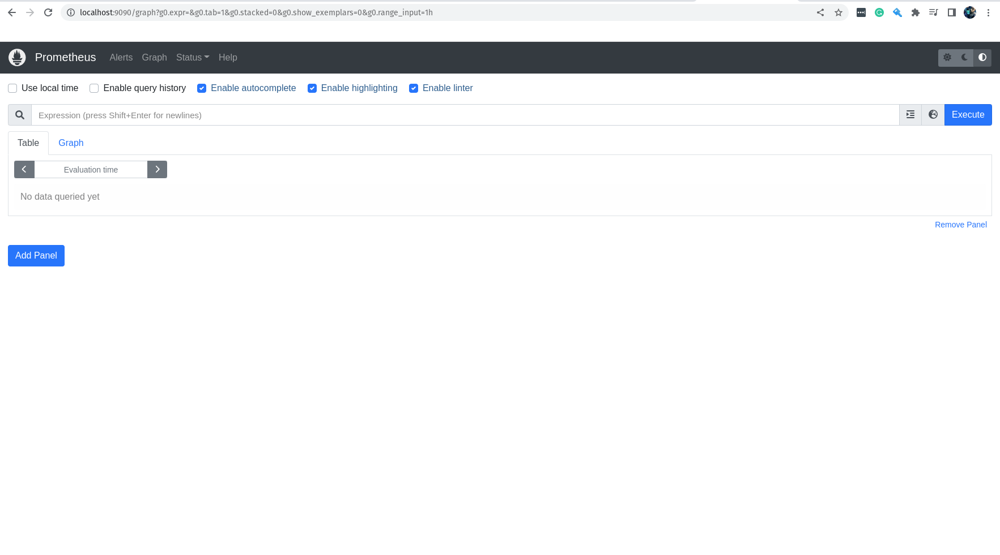

### Instalando o Prometheus

Agora que já sabemos o que é monitoração, observabilidade e o Prometheus, acho que já é o momento de começar a brincar com a estrela desse treinamento, o Prometheus!

É possível realizar a instalação do Prometheus de diversas maneiras. Podemos utilizar uma VM, instancia em algum cloud provider, ou mesmo instalar o Prometheus em um servidor físico local. 
Mas é claro que é possível ter o Prometheus rodando em containers, seja em sua máquina local utilizando Docker ou outro container runtime. Agora se o objetivo é ter o Prometheus rodando em ambiente produtivo é necessário utilizar um orquestrador de containers, como o Kubernetes ou Nomad.

Vamos começar a instalar o Prometheus em uma máquina Linux. Está máquina Linux poderia ser facilmente uma VM, instancia em algum cloud provider, ou mesmo um servidor físico local.

Essa é a nossa primeira instalação do Prometheus, fique tranquilo que no decorrer do treinamento vamos utilizar outras formas, visando passar todo o conhecimento para que você se sinta seguro em utilizar o Prometheus no seu ambiente. E Lembre-se, o nosso foco é ter um treinamento que se aproxima o máximo possível do que seria em seu ambiente de trabalho.


&nbsp;

#### Executando o Prometheus em um node Linux

Uma coisa muito importante é estar familiarizado com o site do Prometheus, pois é de lá que vamos aprender todos os detalhes do Prometheus através da documentação, além de acompanhar outros detalhes e novidades do projeto.

Você pode acessar o site do Prometheus em: https://prometheus.io/

Você pode acessar a seção de Download do site do Prometheus em: https://prometheus.io/download/

Para fazer a execução do Prometheus no Linux de uma maneira que irá funcionar na maioria das distribuições, vamos fazer da seguinte forma:

Primeiro vamos fazer o download do binário do Prometheus, lembrando que existem binários para Linux, Windows e MacOS.

Na verdade, vamos fazer o download dos binários, pois dentro do pacote .tar.gz, existem dois binários, o binário do **Prometheus** e o binário do **Promtool**.

O **Promtool** é um utilitário super legal que permite que você execute queries no Prometheus via linha de comando, ou seja, você pode executar queries no Prometheus através do terminal.

Já o binário do **Prometheus** é o *Prometheus Server* e que faz toda a mágica acontecer.

Ainda existe o diretório **consoles**, **console_libraries** e o arquivo **prometheus.yml**, que é o arquivo de configuração do Prometheus.

Bom, já sabemos de todos os detalhes, bora começar!

Fazendo o download:

```bash
curl -LO https://github.com/prometheus/prometheus/releases/download/v2.38.0/prometheus-2.38.0.linux-amd64.tar.gz
```
&nbsp;

Após o download, vamos extrair o arquivo e acessar o diretório extraído.

```bash
tar -xvf prometheus-2.38.0.linux-amd64.tar.gz
cd prometheus-2.38.0.linux-amd64
```

&nbsp;

Como mencionado anteriormente, o arquivo **prometheus.yml** é o arquivo de configuração do Prometheus e será ele que iremos utilizar para configurar o Prometheus nesse nosso primeiro exemplo.

Vamos ver o conteúdo do arquivo:

```yaml
# my global config
global:
  scrape_interval: 15s # Set the scrape interval to every 15 seconds. Default is every 1 minute.
  evaluation_interval: 15s # Evaluate rules every 15 seconds. The default is every 1 minute.
  # scrape_timeout is set to the global default (10s).

# Alertmanager configuration
alerting:
  alertmanagers:
    - static_configs:
        - targets:
          # - alertmanager:9093

# Load rules once and periodically evaluate them according to the global 'evaluation_interval'.
rule_files:
  # - "first_rules.yml"
  # - "second_rules.yml"

# A scrape configuration containing exactly one endpoint to scrape:
# Here it's Prometheus itself.
scrape_configs:
  # The job name is added as a label `job=<job_name>` to any timeseries scraped from this config.
  - job_name: "prometheus"

    # metrics_path defaults to '/metrics'
    # scheme defaults to 'http'.

    static_configs:
      - targets: ["localhost:9090"]
```
&nbsp;

Vamos tirar alguns comentários e remover os campos que não iremos utilizar por agora.

```yaml
global: # Configurações globais do Prometheus, ou seja, configurações que serão utilizadas em todos os jobs caso não sejam configuradas separadamente dentro de cada job.
  
  scrape_interval: 15s # Intervalo de coleta dos dados, ou seja, a cada 15 segundos o Prometheus vai até o alvo monitorado coletar as métricas, o padrão é 1 minuto.
  
  evaluation_interval: 15s # Intervalo para o Prometheus avaliar as regras de alerta, o padrão é 1 minuto. Não estamos utilizando regras para os alertas, vamos manter aqui somente para referência.

  scrape_timeout: 10s # Intervalos para o Prometheus aguardar o alvo monitorado responder antes de considerar que o alvo está indisponível, o padrão é 10 segundos.

rule_files: # Inicio da definição das regras de alerta, nesse primeiro exemplo vamos deixar sem regras, pois não iremos utilizar alertas por agora.

scrape_configs: # Inicio da definição das configurações de coleta, ou seja, como o Prometheus vai coletar as métricas e onde ele vai encontrar essas métricas.

  - job_name: "prometheus" # Nome do job, ou seja, o nome do serviço que o Prometheus vai monitorar.

    static_configs: # Inicio da definição das configurações estáticas, ou seja, configurações que não serão alteradas durante o processo de coleta.

      - targets: ["localhost:9090"] # Endereço do alvo monitorado, ou seja, o endereço do serviço que o Prometheus vai monitorar. Nesse caso é o próprio Prometheus.
```
&nbsp;

Eu tirei a parte referente ao AlertManager, pois não iremos utilizar ele neste momento para deixar as coisas mais simples e darmos o nosso primeiro passo.

Para saber o que cada linha significa, eu adicionei um comentário em cada uma delas explicando o que ela faz.

Agora que já deixamos o arquivo da forma como queremos e já sabemos cada detalhe, vamos executar o binário do Prometheus.

```bash
./prometheus

ts=2022-08-17T13:08:21.924Z caller=main.go:495 level=info msg="No time or size retention was set so using the default time retention" duration=15d
ts=2022-08-17T13:08:21.924Z caller=main.go:539 level=info msg="Starting Prometheus Server" mode=server version="(version=2.38.0, branch=HEAD, revision=818d6e60888b2a3ea363aee8a9828c7bafd73699)"
ts=2022-08-17T13:08:21.924Z caller=main.go:544 level=info build_context="(go=go1.18.5, user=root@e6b781f65453, date=20220816-13:23:14)"
ts=2022-08-17T13:08:21.924Z caller=main.go:545 level=info host_details="(Linux 5.18.10-76051810-generic #202207071639~1659403207~22.04~cb5f582 SMP PREEMPT_DYNAMIC Tue A x86_64 nu-derval (none))"
ts=2022-08-17T13:08:21.924Z caller=main.go:546 level=info fd_limits="(soft=1024, hard=1048576)"
ts=2022-08-17T13:08:21.924Z caller=main.go:547 level=info vm_limits="(soft=unlimited, hard=unlimited)"
ts=2022-08-17T13:08:21.926Z caller=web.go:553 level=info component=web msg="Start listening for connections" address=0.0.0.0:9090
ts=2022-08-17T13:08:21.926Z caller=main.go:976 level=info msg="Starting TSDB ..."
ts=2022-08-17T13:08:21.927Z caller=tls_config.go:195 level=info component=web msg="TLS is disabled." http2=false
ts=2022-08-17T13:08:21.928Z caller=head.go:495 level=info component=tsdb msg="Replaying on-disk memory mappable chunks if any"
ts=2022-08-17T13:08:21.928Z caller=head.go:538 level=info component=tsdb msg="On-disk memory mappable chunks replay completed" duration=1.773µs
ts=2022-08-17T13:08:21.928Z caller=head.go:544 level=info component=tsdb msg="Replaying WAL, this may take a while"
ts=2022-08-17T13:08:21.928Z caller=head.go:615 level=info component=tsdb msg="WAL segment loaded" segment=0 maxSegment=0
ts=2022-08-17T13:08:21.928Z caller=head.go:621 level=info component=tsdb msg="WAL replay completed" checkpoint_replay_duration=9.788µs wal_replay_duration=213.05µs total_replay_duration=237.767µs
ts=2022-08-17T13:08:21.928Z caller=main.go:997 level=info fs_type=XFS_SUPER_MAGIC
ts=2022-08-17T13:08:21.929Z caller=main.go:1000 level=info msg="TSDB started"
ts=2022-08-17T13:08:21.929Z caller=main.go:1181 level=info msg="Loading configuration file" filename=prometheus.yml
ts=2022-08-17T13:08:21.931Z caller=main.go:1218 level=info msg="Completed loading of configuration file" filename=prometheus.yml totalDuration=2.070216ms db_storage=531ns remote_storage=1.002µs web_handler=220ns query_engine=420ns scrape=1.716011ms scrape_sd=201.818µs notify=1.222µs notify_sd=4.198µs rules=1.473µs tracing=8.426µs
ts=2022-08-17T13:08:21.931Z caller=main.go:961 level=info msg="Server is ready to receive web requests."
ts=2022-08-17T13:08:21.931Z caller=manager.go:941 level=info component="rule manager" msg="Starting rule manager..."
```
&nbsp;

Através da linha abaixo podemos ver que o prometheus está rodando.

```bash
ts=2022-08-17T13:08:21.931Z caller=main.go:961 level=info msg="Server is ready to receive web requests."
```
&nbsp;

Evidentemente, estamos utilizando o Prometheus dessa forma apenas para testes e para que possamos dar os primeiros passos em nosso treinamento.

Se você pressionar CTRL+C, o Prometheus irá ser finalizado.

Caso você queira executar o Prometheus e deixar o seu terminal livre e independente do processo do Prometheus, você pode fazer isso através do comando abaixo.

```bash
nohup ./prometheus &
```
&nbsp;

Assim ele irá rodar em segundo plano e não será interrompido caso você feche o terminal.

Mas lembre-se novamente, estamos fazendo isso somente para dar os primeiros passos, não vá colocar isso em ambiente de produção, e ainda dizer que aprendeu comigo, seria muita mancada. hahaha

Para verificar se o processo está em execução, basta fazer o seguinte:

```bash
ps -ef | grep prometheus
jeferson   23539    6584  0 16:20 pts/0    00:00:00 ./prometheus
```
&nbsp;

Vamos deixar o terminal de lado por um segundo, e bora acessar a interface web do Prometheus usando o nosso navegador.

O Prometheus roda por padrão na porta TCP 9090, portanto vamos acessar a interface web através do seguinte endereço:

```bash
http://localhost:9090
```
&nbsp;

A tela que você vê é a seguinte, correto?


&nbsp;

Nós vamos brincar bastante nessa interface e iremos conhecer cada pixel dela, porém por agora vamos apenas testar uma query super simples, somente para dar um gostinho de como funciona.

Na barra de criação de queries, vamos escrever a query que queremos testar.

```promql
process_cpu_seconds_total{job="prometheus"}[1m]
```

&nbsp;




&nbsp;

Nessa query, estamos pegando os valores da métrica process_cpu_seconds_total, que é a métrica que nos informa o tempo de CPU gasto por cada processo, filtrando apenas pelos jobs que tem o nome prometheus e estamos pegando somente os valores do último minuto.

Você lembra que definimos no arquivo de configuração do Prometheus o parâmetro *scrape_interval* para que ele coletasse os dados a cada 15 segundos? 

Eu espero que sim! :D

Então, se tudo está correndo bem você terá como resultado da query acima 4 valores, afinal estamos pegando os valores do último minuto.



&nbsp;

Muito bem, já demos o primeiro passo para o nosso treinamento, já conhecemos a cara do Prometheus e inclusive fizemos a nossa primeira query.

Agora vamos ver uma instalação da maneira correta em uma máquina Linux. Ainda vamos utilizar a configuração básica do Prometheus, mas iremos cuidar dos binários e do serviço do Prometheus da maneira correta. :D

&nbsp;

#### Instalação do Prometheus no Linux

Vamos fazer a instalação em uma máquina Linux rodando a distribuição Ubuntu, mas lembre-se que é possível fazer isso em qualquer outra distribuição.

Primeiro vamos fazer o download do binário do Prometheus, lembrando que existem binários para Linux, Windows e MacOS.

Na verdade, vamos fazer o download dos binários, pois dentro do pacote .tar.gz, existem dois binários, o binário do **Prometheus** e o binário do **Promtool**.

O **Promtool** é um utilitário super legal que permite que você execute queries no Prometheus via linha de comando, ou seja, você pode executar queries no Prometheus através do terminal.

Já o binário do **Prometheus** é o *Prometheus Server* e que faz toda a mágica acontecer.

Ainda existe o diretório **consoles**, **console_libraries** e o arquivo **prometheus.yml**, que é o arquivo de configuração do Prometheus.

Bom, já sabemos de todos os detalhes, bora começar!

Fazendo o download:

```bash
curl -LO https://github.com/prometheus/prometheus/releases/download/v2.38.0/prometheus-2.38.0.linux-amd64.tar.gz
```

&nbsp;

Após o download, vamos extrair os arquivos.

```bash
tar -xvf prometheus-2.38.0.linux-amd64.tar.gz
```
&nbsp;

Agora vamos mover os binários para o diretório /usr/local/bin.

```bash
sudo mv prometheus-2.38.0.linux-amd64/prometheus /usr/local/bin/prometheus
sudo mv prometheus-2.38.0.linux-amd64/promtool /usr/local/bin/promtool
```
&nbsp;

Vamos ver se o binário está funcionando.

```bash
prometheus --version

prometheus, version 2.38.0 (branch: HEAD, revision: 818d6e60888b2a3ea363aee8a9828c7bafd73699)
  build user:       root@e6b781f65453
  build date:       20220816-13:23:14
  go version:       go1.18.5
  platform:         linux/amd64
```
&nbsp;

Agora vamos criar o diretório de configuração do Prometheus.

```bash
sudo mkdir /etc/prometheus
```
&nbsp;

Vamos mover os diretórios *consoles*, *console_libraries* e o arquivo *prometheus.yml* para o diretório de configuração do Prometheus.

```bash
sudo mv prometheus-2.38.0.linux-amd64/prometheus.yml /etc/prometheus/prometheus.yml
sudo mv prometheus-2.38.0.linux-amd64/consoles /etc/prometheus
sudo mv prometheus-2.38.0.linux-amd64/console_libraries /etc/prometheus
```
&nbsp;

Vamos editar o arquivo de configuração do Prometheus para deixar como fizemos em nosso primeiro exemplo.

```bash
sudo vim /etc/prometheus/prometheus.yml
```
&nbsp;

Agora edite o arquivo e deixe com o seguinte conteúdo: (você pode remover os comentários para deixar mais simples o arquivo)

```yaml
global: # Configurações globais do Prometheus, ou seja, configurações que serão utilizadas em todos os jobs caso não sejam configuradas separadamente dentro de cada job.
  
  scrape_interval: 15s # Intervalo de coleta dos dados, ou seja, a cada 15 segundos o Prometheus vai até o alvo monitorado coletar as métricas, o padrão é 1 minuto.
  
  evaluation_interval: 15s # Intervalo para o Prometheus avaliar as regras de alerta, o padrão é 1 minuto. Não estamos utilizando regras para os alertas, vamos manter aqui somente para referência.

  scrape_timeout: 10s # Intervalos para o Prometheus aguardar o alvo monitorado responder antes de considerar que o alvo está indisponível, o padrão é 10 segundos.

rule_files: # Inicio da definição das regras de alerta, nesse primeiro exemplo vamos deixar sem regras, pois não iremos utilizar alertas por agora.

scrape_configs: # Inicio da definição das configurações de coleta, ou seja, como o Prometheus vai coletar as métricas e onde ele vai encontrar essas métricas.

  - job_name: "prometheus" # Nome do job, ou seja, o nome do serviço que o Prometheus vai monitorar.

    static_configs: # Inicio da definição das configurações estáticas, ou seja, configurações que não serão alteradas durante o processo de coleta.

      - targets: ["localhost:9090"] # Endereço do alvo monitorado, ou seja, o endereço do serviço que o Prometheus vai monitorar. Nesse caso é o próprio Prometheus.
```
&nbsp;

Não podemos esquecer do diretório onde o Prometheus guardará seus dados.
    
```bash
sudo mkdir /var/lib/prometheus
```
&nbsp;

Vamos criar um grupo e um usuário para o Prometheus.

```bash
sudo addgroup --system prometheus
sudo adduser --shell /sbin/nologin --system --group prometheus
```
&nbsp;

Precisamos fazer com que o Prometheus seja um serviço em nossa máquina, para isso precisamos criar o arquivo de *service unit* do *SystemD*.

```bash
sudo vim /etc/systemd/system/prometheus.service
```
&nbsp;

Vou deixar o conteúdo do arquivo aqui embaixo e linha por linha comentada, somente para que você possa entender o que está rolando e aprender alguma coisa extra. :D

```yaml
[Unit] # Inicio da definição do serviço.
Description=Prometheus # Descrição do serviço.
Documentation=https://prometheus.io/docs/introduction/overview/ # Documentação do serviço.
Wants=network-online.target # Para que o serviço do Prometheus seja iniciado, precisamos antes que o serviço de rede esteja ativo.
After=network-online.target # Depois que o serviço de rede esteja ativo, o serviço do Prometheus será iniciado.

[Service] # Inicio da definição do serviço.
Type=simple # Tipo do serviço, o padrão é simple, ou seja, o serviço é simples, não tem subserviços.
User=prometheus # Usuário do serviço, o padrão é prometheus, o mesmo que criamos no passo anterior.
Group=prometheus # Grupo do serviço, o padrão é prometheus, o mesmo que criamos no passo anterior.
ExecReload=/bin/kill -HUP \$MAINPID # Comando para o serviço do Prometheus ser reiniciado, o padrão é /bin/kill -HUP \$MAINPID, ou seja, o serviço do Prometheus será reiniciado ao receber um sinal de reinicialização.
ExecStart=/usr/local/bin/prometheus \ # Comando para o serviço do Prometheus ser iniciado, o padrão é /usr/local/bin/prometheus, o mesmo lugar para onde mandamos o binário do Prometheus no passo anterior.
  --config.file=/etc/prometheus/prometheus.yml \ # Arquivo de configuração do serviço do Prometheus, o padrão é /etc/prometheus/prometheus.yml, o mesmo lugar onde mandamos o arquivo de configuração do Prometheus no passo anterior.
  --storage.tsdb.path=/var/lib/prometheus \ # Diretório onde o serviço do Prometheus vai armazenar seus dados, o padrão é /var/lib/prometheus, o mesmo lugar onde criamos o diretório para armazenar os dados do Prometheus.
  --web.console.templates=/etc/prometheus/consoles \ # Diretório onde o serviço do Prometheus vai encontrar os templates para os consoles, o padrão é /etc/prometheus/consoles, o mesmo lugar para onde movemos o diretório para armazenar os templates dos consoles.
  --web.console.libraries=/etc/prometheus/console_libraries \ # Diretório onde o serviço do Prometheus vai encontrar as bibliotecas para os consoles, o padrão é /etc/prometheus/console_libraries, o mesmo lugar para onde movemos o diretório para armazenar as bibliotecas dos consoles.
  --web.listen-address=0.0.0.0:9090 \ # Endereço do serviço do Prometheus, o padrão é o serviço escutar na porta 9090.
  --web.external-url= # Endereço externo do serviço do Prometheus, por exemplo o endereço DNS do serviço.

SyslogIdentifier=prometheus # Identificador do serviço no syslog, o padrão é prometheus.
Restart=always # Reinicialização do serviço, o padrão é always, ou seja, o serviço será reiniciado sempre que ocorrer alguma alteração.

[Install] # Inicio da definição do instalador do serviço.
WantedBy=multi-user.target # Definir em qual grupo o serviço será iniciado, o padrão é multi-user.target.
```
&nbsp;

Agora vamos adicionar o seguinte conteúdo ao arquivo de configuração do service unit do Prometheus: 
Eu tirei os comentários para evitar algum problema e para deixar o arquivo mais legível.

```bash
[Unit]
Description=Prometheus
Documentation=https://prometheus.io/docs/introduction/overview/
Wants=network-online.target
After=network-online.target

[Service]
Type=simple
User=prometheus
Group=prometheus
ExecReload=/bin/kill -HUP \$MAINPID
ExecStart=/usr/local/bin/prometheus \
  --config.file=/etc/prometheus/prometheus.yml \
  --storage.tsdb.path=/var/lib/prometheus \
  --web.console.templates=/etc/prometheus/consoles \
  --web.console.libraries=/etc/prometheus/console_libraries \
  --web.listen-address=0.0.0.0:9090 \
  --web.external-url=

SyslogIdentifier=prometheus
Restart=always

[Install]
WantedBy=multi-user.target
```
&nbsp;

Se você não sabe o que é o *SystemD*, você pode consultar o manual do *SystemD* ou ainda ver o conteúdo sobre SystemD que eu já criei lá no canal da [LINUXtips](https://www.youtube.com/LINUXtips).

Acredito que já criamos todos os arquivos e diretórios necessários para o funcionamento do Prometheus, agora vamos mudar o dono desses diretórios e arquivos que criamos para que o usuário do prometheus seja o dono dos mesmos.

```bash
sudo chown -R prometheus:prometheus /etc/prometheus
sudo chown -R prometheus:prometheus /var/lib/prometheus
sudo chown -R prometheus:prometheus /usr/local/bin/prometheus
sudo chown -R prometheus:prometheus /usr/local/bin/promtool
```
&nbsp;

Vamos fazer um reload no systemd para que o serviço do Prometheus seja iniciado.

```bash
sudo systemctl daemon-reload
```
&nbsp;


Vamos iniciar o serviço do Prometheus.

```bash
sudo systemctl start prometheus
```
&nbsp;

Temos que deixar o serviço do Prometheus configurado para que seja iniciado automaticamente ao iniciar o sistema.

```bash
sudo systemctl enable prometheus
```
&nbsp;

Para garantir, vamos ver o status do serviço do Prometheus.

```bash
sudo systemctl status prometheus
```
&nbsp;

Você pode verificar nos logs se tudo está rodando maravilhosamente.

```bash
sudo journalctl -u prometheus
```
&nbsp;

E se você encontrar a seguinte mensagem no log, significa que o serviço do Prometheus está funcionando corretamente.

```bash
level=info msg="Server is ready to receive web requests."
```
&nbsp;

E para finalizar a brincadeira, vamos acessar a nossa interface web do Prometheus através do seguinte endereço em seu navegador.

```bash
http://localhost:9090
```
&nbsp;

Você verá uma tela maravilhosa como mostra a imagem abaixo.


&nbsp;

&nbsp;
